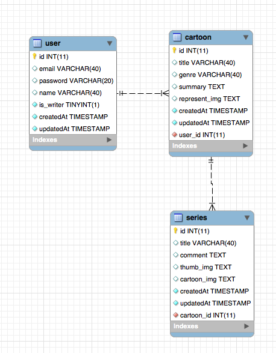

# 인터넷 프로그래밍 과제

## 주제: 웹툰관리 프로젝트

## 진행중인 사항
* 2017.09.05 목업완료(docs), pencil project 툴 이용[(https://pencil.evolus.vn/)]((https://pencil.evolus.vn/))
* 2017.09.06 ~ 2017.09.07 퍼블리싱완료(css, html)
* 2017.09.19 웹툰 리스트 css 수정, JS추가(jQuery), 삭제 체크박스 추가, 삭제 시 다시 물어보는 alert
* 2017.09.23 새로 만드는 부분 뷰 수정(제출~)
* 2017.09.26 폼에서 자바스크립트 밸류 추출하는 과제 생성중(과제가 아직 안나옴..)
* 2017.09.29 폼에서 자바스크립트 밸류 추출하는 과제 완료(따로 파일 만들어서 유지)
* 2017.10.01 백그라운드 이미지 추가.(이미지는 velopert님 깃헙[https://raw.githubusercontent.com/velopert/bitimulate/master/bitimulate-frontend/src/static/images/background.png](https://raw.githubusercontent.com/velopert/bitimulate/master/bitimulate-frontend/src/static/images/background.png))에서 가지고 왔습니다. 문제시 삭제하겠습니다.
* 2017.11.18 JSP페이지로 전부 변경, 뷰 페이지 로직 페이지 분리, 메인 페이지 생성(뭔가 허접..)
* 2017.11.19 DB 테이블 생성(admin 생성), 모델링  
 
* 2017.11.25 mysql bean 분리 

----- 

## 필수 스펙
1. 만화 리스트 출력 기능
- (완료) 등록되어 있는 만화 리스트가 출력되어야 합니다. (완료)
- (완료) 리스트에 출력되는 항목은 만화 제목, 장르, 대표이미지, 작가명으로 합니다. 단, 각자 설계한 스토리보드에 따라 지정된 항목외에 다른 항목도 출력 가능합니다. 
- (완료) 만화 제목을 선택하면 세부 정보가 출력되고, 회차별 만화 제목에 대한 리스트가 출력되어야 합니다. 즉, 하나의 만화엔 여러 회차의 만화들이 존재하는 구조입니다. 

2. 만화 검색 기능
- (완료) 만화제목과 작가명으로 만화를 검색할 수 있어야 합니다. 

3. 만화 등록 기능
- (완료) 만화 등록시 포함되어야 하는 항목은 다음과 같습니다. 단, 필요에 따라 항목을 추가할 수 있습니다. : 만화 제목, 장르, 줄거리, 대표이미지, 작가명

4. 만화 삭제 기능
- (완료) 만화를 리스트에서 삭제할 수 있도록 합니다. 단, 만화를 삭제하면, 삭제된 만화제목에 속한 모든 회차의 만화들도 같이 삭제되어야 합니다. 

5. 만화 수정 기능
- (완료)등록한 만화에 대한 각 정보들(만화제목, 장르, 줄거리, 대표이미지, 작가명 등)을 수정 할 수 있어야 합니다. 

6. 회차별 만화등록 기능
- (완료) 등록한 만화제목에 대하여 1회 이상의 회차별 만화를 등록할 수 있어야 합니다. 
- (완료) 회차별로 등록하는 만화 정보는 다음과 같습니다. 단, 제출자의 필요에 따라 항목을 추가할 수 있습니다. : 회차번호(회차번호는 등록할 때마다 자동으로 증가될 수 있도록 합니다.), 회차제목, 
- (완료) 회차별 썸네일, 만화그림파일, 작가의 말, 운영원칙 동의 체크

7. 회차 만화 리스트 출력 기능
- (완료) 만화리스트에서 만화제목을 선택하면, 세부 만화정보와 함께, 회차별 만화 제목 리스트가 출력되도록 합니다. 
- (완료) 회차별 만화제목 리스트의 출력 항목은 "회차별썸네일이미지, 회차별제목, 등록일"로합니다만, 제출자의 필요에 따라 출력 항목을 추가할 수 있습니다. 

8. 회차 만화 수정 기능
-(완료)등록한 각 회차 만화에 대한 각 정보들을 수정할 수 있어야 합니다. 단, 수정할 수 있는 정보는 제출자가 정의한 항목에 따라 추가할 수 있습니다. : 회차제목, 회차별썸네일, 만화그림파일, 작가의 말

9. 회차별 만화 삭제 기능
- (완료)회차별 만화리스트에서 삭제할 수 있어야 합니다. 

10. UI 네비게이션 구성
(완료) 사용자의 편의를 고려하여, 링크가 용이하게 연결되도록 네비게이션이 구성되어야 합니다. 
(완료) 원하는 컨텐츠나 기능을 빠르게 찾을 수 있도록 구성되어야 합니다. -현재 일어나고 있는 상황에 대한 정보와 피드백 정보, 위치 정보가 제공되어야 합니다. 

11. 기타 기능 
- 위 기본 기능 외에 추가로 필요하다고 판단되는 다른 기능들을 추가 할 수 있으며, 추가된 기능의 난이도와 기능 수에 따라 프로젝트 총점을 기준으로 최대 30% 가산점이 부여될 수 있습니다.
  - 로그인 기능
  - 반응형
  - 웹툰 보는화면
  
  

